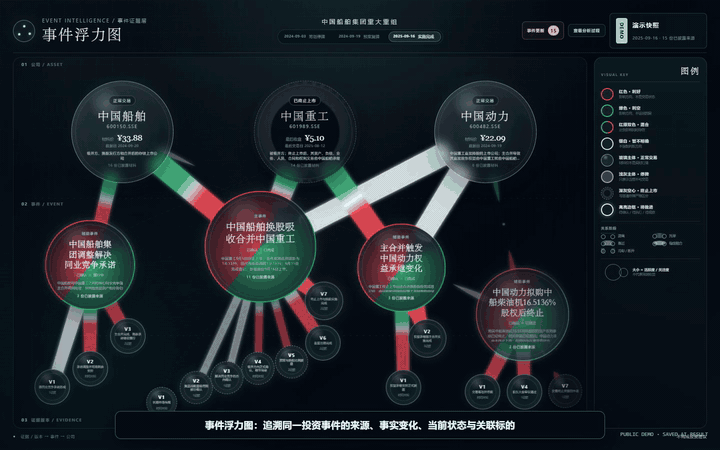

> 提交附件内容较大，完整源码、演示数据与验证材料见 [GitHub 仓库](https://github.com/lizihe1120-gif/event-intelligence-buoyancy-map)。
>
> 在线演示：[https://lizihe1120-gif.github.io/event-intelligence-buoyancy-map/](https://lizihe1120-gif.github.io/event-intelligence-buoyancy-map/)
>
> 演示视频：[event-intelligence-demo.mp4](outputs/event-intelligence-web/event-intelligence-demo.mp4)（101.2 秒，1440×900，中文字幕）。

<a href="outputs/event-intelligence-web/event-intelligence-demo.mp4">
  
</a>

<p align="center"><sub>1.5 倍速循环预览；点击画面查看 101.2 秒高清演示视频。</sub></p>

# 事件浮力图

> 用一张可回看的证据—事件—公司关系图，帮助投资者看清同一事件从最初线索到正式落地的变化、当前状态与受影响标的。

## 产品回应

公开市场中的重大事件往往同时包含传闻、新闻、研究观点、公司回应、正式公告和后续实施材料。信息消费者真正需要解决的并不是“再看一条新闻”，而是：这些材料是否属于同一事件、哪些内容是事实、结论发生了什么变化、事件是否确认和执行、不同公司受到的影响是否相同，以及市场是否已经出现可观察反应。

“事件浮力图”把这一问题整理为自下而上的关系：

```text
来源与证据版本 → 事件 → 公司
```

本提交以中国船舶、中国重工和中国动力为演示对象，以中国船舶换股吸收合并中国重工作为主事件，并保留三个辅助事件。页面不是行情预测器，气泡大小表示材料活跃度与关注度，不表示预期收益。

## 目标用户与核心问题

目标用户是需要快速判断重大事件真实性、演化阶段和标的关系的投资研究人员、投顾、财经编辑与个人投资者。

核心问题包括：

- 最初可验证来源是什么？
- 多份材料是否属于同一事件？
- 哪些主张是事实、观点、推测或传闻？
- 新材料是在支持、补充、更新、否认、更正还是替代旧结论？
- 事件是否确认，与事件是否执行完成有什么区别？
- 同一事件对不同公司为何可能分别为利多、利空、混合或暂不明确？
- 市场出现价格变化，是否只能描述为观察，不能直接当作因果证明？

## 当前已实现功能

- 三家公司泡泡：中国船舶、中国重工、中国动力。
- 一个主合并事件与三个辅助事件。
- 证据/版本 → 事件 → 公司的 SVG 关系图。
- 三个可切换演化快照，历史快照不会提前展示未来版本。
- 停牌、复牌、正常交易和终止上市的独立视觉语义。
- 红色利多、绿色利空、红绿双色混合、银白暂不明确。
- 公司、事件和版本节点的鼠标悬停、键盘聚焦及关联链高亮。
- 只读“查看分析过程”面板，展示七步 Demo 分析链路。
- 事件详情抽屉：概览、完整版本演化、证据与冲突、逐公司影响与市场反应、AI 分析记录。
- 通知中心：15 条真实相邻版本变化、快照过滤、已读状态和通知到事件版本的定位。
- 否认、更正、过期规则样例与真实事件隔离，不进入真实事件数、来源数或通知数。
- 游离、托举、靠近、稳定融合、冷却/断开五种确定性液态关系形态。
- 本地可重复生成的保存运行产物、结构校验和 VisualModelBuilder。
- `SavedAnalysisProvider` 与禁用状态的 `OnlineAnalysisProvider` 共用统一接口；默认演示完全离线且不需要 API Key。
- `prefers-reduced-motion` 支持。

## 三个演化快照

| 演示快照 | 页面状态 |
| --- | --- |
| 2024-09-03 · 筹划停牌 | 中国船舶和中国重工显示停牌；展示停牌前最后交易日与最后收盘价；停牌不等于利空。 |
| 2024-09-19 · 预案复牌 | 两家公司显示复牌；展示中国船舶、中国重工和中国动力在公告附近已经取得的市场观察；措辞使用“观察到的变化”。 |
| 2025-09-16 · 实施完成 | 主合并完成；中国重工终止上市；中国动力权益承继完成；显示全部关键版本节点。 |

每个公司价格旁都保留自身真实数据日期。右上角日期明确标记为“演示快照”，不冒充统一实时行情更新时间。

## Demo 分析管线

当前 18 份来源是一次已经完成采集后保存的来源快照，不是本轮实时抓取结果。

```text
18份保存来源
  → 精确去重与转载折叠
  → 4个事件簇
  → Prompt Builder
  → SavedAnalysisProvider
  → JSON Schema、引用与语义校验
  → visual-result.json
  → 三个事件浮力图快照
```

运行信息：

- 运行 ID：`material-analysis-001`
- Prompt 版本：`material-analysis-v1`
- Provider：`saved_result`
- 模型名称：`unknown`。现有材料无法确认实际模型，因此不作猜测。
- 来源数量：18
- 计权证据：11
- 事件簇：4
- 主张：44
- 运行产物：9 份 JSON（8 份核心分析产物及 1 份确定性派生通知产物）

当前运行没有调用真实爬虫、外部采集 Agent、iFinD 或扶摇，也没有进行在线模型调用。AI 分析使用保存的运行产物。

生产构建会先重新执行本地分析管线，再进行 TypeScript 和 Vite 构建；校验失败的分析结果不能进入视觉模型。

## 同一事件、版本与主张

事件聚类综合使用结构化 `event_id`、关联公司、交易对手或标的、事件类型、关键实体和数字、时间连续性及后文是否承接前文。当前材料确定性形成四个事件簇；轮廓系数只保存在聚类结果中作为诊断指标，不用于去重、来源归属或强制选择固定 K。

每条分析主张被标记为：

- `fact`：来源直接支持的可核验事实；
- `opinion`：专家、机构或媒体的观点；
- `inference`：在已有材料上作出的推测；
- `rumor`：尚未得到充分确认的市场传闻。

版本之间允许 `supports`、`supplements`、`updates`、`denies`、`corrects` 和 `supersedes`。关键结论可以通过 `event_id` → `claim_id` → `source_id` 回溯到实际来源。

## 来源去重、事件聚类与证据权重

精确去重使用：

- `document_id`
- 规范化 URL
- 规范化内容哈希
- 发布主体、标题和发布时间组合

近重复与转载识别使用标题相似度、规范化文本相似度、原始来源、发布时间距离和 `is_reprint`。转载和镜像不会被删除，仍保留完整追溯信息，但不会重复增加证据权重。

证据权重不等于来源真伪评分。它只用于阻止同一公告的多个镜像或转载重复放大证据数量。

## 双状态、四类时间与逐公司影响

事件状态被拆成两个维度：

- `confirmation_status`：传闻、待确认、部分确认、已确认、被否认、被更正等；
- `execution_status`：未开始、筹划、待审批、待实施、实施中、已完成、已终止、已过期等。

`confirmed` 不等于 `completed`，`completed` 也不表示市场已经完全定价。

事件版本尽量区分四类时间：

- `occurred_at`：事件实际发生时间；
- `disclosed_at`：对外披露时间；
- `fetched_at`：系统获取材料时间；
- `analysis_updated_at`：分析结论更新时间。

当 `occurred_at` 不可知时，页面显示“实际发生时间未知”，不会用新闻发布时间代替。

影响判断按“事件—公司”分别输出 `positive`、`negative`、`mixed` 或 `unclear`，并保存正面因素、负面因素、不确定因素、置信度、依据主张和来源。停牌和终止上市是交易状态，不会直接被转换为利空方向。

## 市场反应不等于事实确认

历史价格、收益率、成交量和成交额来自行情材料及确定性公式，不由 AI 生成。AI 只解释已经计算出的观察结果。

页面使用“公告附近观察到股价或成交量变化”等相关性措辞。价格上涨不能证明传闻为真，价格下跌也不能证明事件为假；行情变化只表示时间相关观察，不证明事件与价格变化之间存在因果关系。

## AI 的角色

AI 参与：同一事件判断、主张抽取、主张类型分类、版本关系识别、双状态整理、逐公司影响分析、因素与不确定性说明，以及将保存材料组织为固定 JSON 响应。

程序负责：精确去重、转载折叠、确定性事件聚类、JSON Schema 校验、引用完整性、枚举与时间检查、禁止 AI 生成行情字段、禁止观点或传闻单独确认事实，以及校验失败时阻断视觉结果。

`SavedAnalysisProvider` 与 `OnlineAnalysisProvider` 实现同一 `AnalysisProvider` 接口。保存结果是默认、离线且无需密钥的演示模式；在线 Provider 当前保持 `disabled`，没有安全服务端代理时返回 `ONLINE_PROVIDER_REQUIRES_SERVER_PROXY`。本提交没有调用外部模型，也没有 API Key 设置页。接口与安全边界见 `docs/AI_PROVIDER_INTERFACE.md`。

## 数据来源与限制

材料包括公司公告、交易所和监管机构材料、权威新闻、研究观点及历史行情来源。完整来源、必要摘录、发布时间、抓取时间、第一手标记和转载标记保存在 `data/demo/`。

主要限制：

- iFinD 和扶摇在采集环境不可用；没有虚构其成功调用。
- 18 份来源是保存快照，不是实时资讯流。
- 部分研报仅取得可访问摘要，没有扩展引用不可核验的目标价或完整模型。
- 没有公告后 5 分钟、30 分钟、4 小时的完整分钟行情。
- 中国重工退市后，部分公开行情接口不再返回数据，相关历史价格使用可追溯替代来源。
- 没有完整行业指数序列，部分市场观察无法与行业波动彻底分离。

## 项目架构与主要目录

```text
apps/event-intelligence-web/
  src/
    App.tsx                       # 三快照首页与交互
    dataAdapter.ts               # 原始材料 + visual-result ViewModel
    AnalysisProcessPanel.tsx      # 七步只读分析过程
    EventDetailDrawer.tsx         # 可追溯事件详情
    NotificationCenter.tsx        # 版本变化与站内通知
    RelationLayer.tsx             # 五种液态关系形态
    analysisRunAdapter.ts         # 运行产物到面板的适配
    pipeline/
      deduplicateSources.ts
      clusterEvents.ts
      buildAnalysisPrompt.ts
      analysisProvider.ts
      generateAnalysisResponse.ts
      validateAnalysisResponse.ts
      buildVisualModel.ts
      generateDemoRun.ts
      runPipelineCli.ts
  vite.pipeline.config.ts

data/demo/                       # 第一阶段封板材料
data/demo-runs/material-analysis-001/
  run.json
  acquisition-output.json
  deduplication-result.json
  clustering-result.json
  analysis-request.json
  analysis-response.json
  validation-result.json
  visual-result.json
  notifications.json

docs/
  AI_PROVIDER_INTERFACE.md
  AI_USAGE_AND_VALIDATION.md
  event-intelligence-demo-script.md

outputs/event-intelligence-web/
  snapshot-2024-09-03-1440x900.png
  snapshot-2024-09-19-1440x900.png
  snapshot-2025-09-16-1440x900.png
  event-intelligence-demo.mp4      # 101.2 秒中文字幕演示成片
```

## 安装与本地运行

要求：Node.js 22+、npm 10+。

```bash
npm install
npm run dev --workspace @event-intelligence/web -- --host 127.0.0.1 --port 5174
```

访问：`http://127.0.0.1:5174/`

公网演示：[https://lizihe1120-gif.github.io/event-intelligence-buoyancy-map/](https://lizihe1120-gif.github.io/event-intelligence-buoyancy-map/)

部署方式：GitHub Pages + GitHub Actions；工作流会在发布前重新执行类型检查、测试和生产构建。

## 重新生成分析产物、测试与构建

重新生成 9 份运行产物（8 份核心分析产物及 1 份派生通知产物）：

```bash
npm run pipeline:generate --workspace @event-intelligence/web
```

类型检查、测试和生产构建：

```bash
npm run typecheck --workspace @event-intelligence/web
npm run test --workspace @event-intelligence/web
npm run build --workspace @event-intelligence/web
```

`build` 会再次执行 `pipeline:generate`，然后运行 TypeScript 构建和 Vite 生产构建。

## 已执行验证

2026-10-06（Asia/Shanghai）重新执行：

- `pipeline:generate`：通过，生成 9 份运行产物（8份核心分析产物及1份派生通知产物）；
- `typecheck`：通过；
- `test`：8 个测试文件、60 项测试全部通过；
- `build`：通过，且构建期间再次成功生成 9 份运行产物；
- 浏览器检查：在 1440×900 和 1366×768 检查三个快照、分析面板、事件详情、通知中心、AI 分析记录、液态关系和横向溢出；公网部署页面实际加载正常，控制台无错误或警告。

测试覆盖来源数量、精确重复计权、转载追溯、4 个事件簇、轮廓系数用途、引用解析、非法枚举、AI 行情字段、`mixed`/`unclear`、逐公司不同方向、校验失败阻断、三个快照、详情、通知、五种关系视觉，以及统一 Provider、固定请求、显式回退和密钥不落盘。

## 截图


## AI 使用记录与演示材料

- AI 使用与验证记录：`docs/AI_USAGE_AND_VALIDATION.md`
- 演示脚本与镜头表：`docs/event-intelligence-demo-script.md`
- 演示视频：[`outputs/event-intelligence-web/event-intelligence-demo.mp4`](outputs/event-intelligence-web/event-intelligence-demo.mp4)

## 已知边界与未实现事项

本提交没有实现，也不声称已经实现：

- 实时抓取；
- 外部采集 Agent；
- 真实在线模型调用与安全服务端代理；
- API Key 设置；
- 公司详情页；
- 邮件、短信或浏览器推送；
- 后台任务和实时行情；
- 移动端。

第一至第七阶段已经执行；独立仓库、GitHub Actions、公网部署与 101.2 秒中文字幕演示视频已经完成。

## 投资与合规声明

本项目仅用于产品能力演示和公开材料的信息结构化。事件影响方向由 AI 基于可追溯文本作演示性判断，不构成证券研究报告、投资顾问意见、收益承诺或任何买卖建议。使用者应自行核验原始公告和监管信息，并独立承担投资决策责任。
